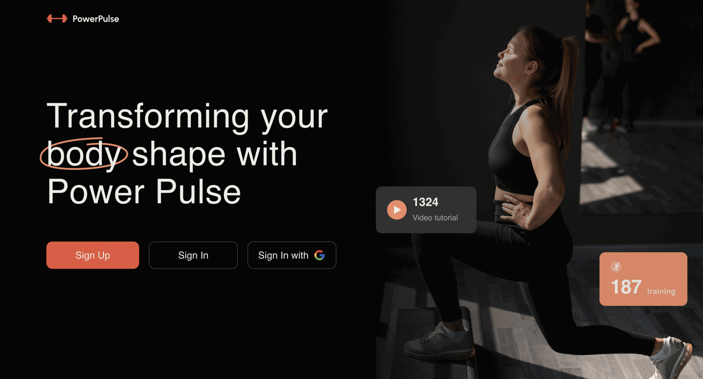
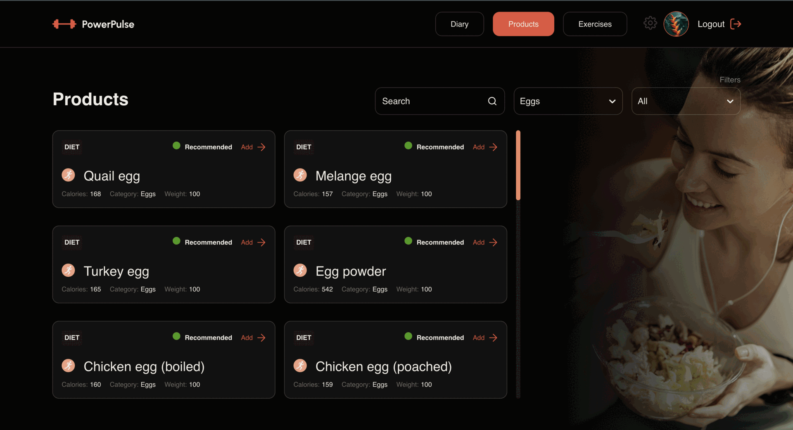
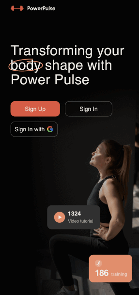

# React & Node.js Team Project

## About The Project Power Pulse

Welcome to our Calorie Tracker & Fitness Manager Web App! This application helps users track their daily calorie consumption and manage their fitness journey by selecting exercises and food products to eat. Whether you're trying to lose weight, maintain a healthy lifestyle, or build muscle, our app provides the tools you need to achieve your fitness goals.

Sign In/Sign Out: Users can securely sign in and sign out of their accounts to access their personalized data.

Progress Visualization: Visualize your progress through charts and graphs to stay motivated and on track.

User Profiles: Create and customize your user profile to tailor the app to your specific needs and preferences.

Calorie Tracking: Users can easily track their daily calorie intake and monitor their progress over time.

Nutrition Database: Access a comprehensive database of food products to log your meals and snacks, complete with nutritional information.

Personalized Recommendations: Receive personalized recommendations based on your fitness goals, blood group, and dietary preferences.

Exercise Selection: Browse through a variety of exercises categorized by muscle group and type of workout.

Mobile Support: Responsive design ensures seamless usage on mobile devices, allowing users to track their fitness on the go.

### Built With
* []
* []
* []
* []
* []
* []
* []
* []
* []
* []
* []

# Frontend Developers
- [Sergey Bodnariuk **Team Lead & Developer**](https://github.com/sergeycrew)
- [Danylo Mikheev **Project Manager & Developer**](https://github.com/CaXaR777)
- [Victoria Zherebtsova **Scrum master & Developer**](https://github.com/ilnickii)
- [Tetiana Kravchenko **Developer**](https://github.com/Avelinka)
- [Anna Samoilenko **Developer**](https://github.com/Annargb)
- [Pavel Ilnytskyi **Developer**](https://github.com/ilnickii)
- [Valery Rublevska **Developer**](https://github.com/Rublevska)

  
# [Backend Developers](https://github.com/ShoTuPalush/BackEnd-Power-Pulse-7/tree/main)
- [Max Tsekhmaistruk **Team Lead & Developer**](https://github.com/ShoTuPalush)
- [Kateryna Kotelevska **Developer**](https://github.com/rmlyaaa)
- [Maksym Dranovskyi **Developer**](https://github.com/Maksym-nl)